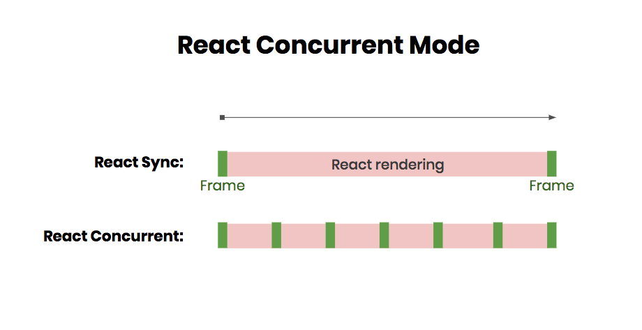
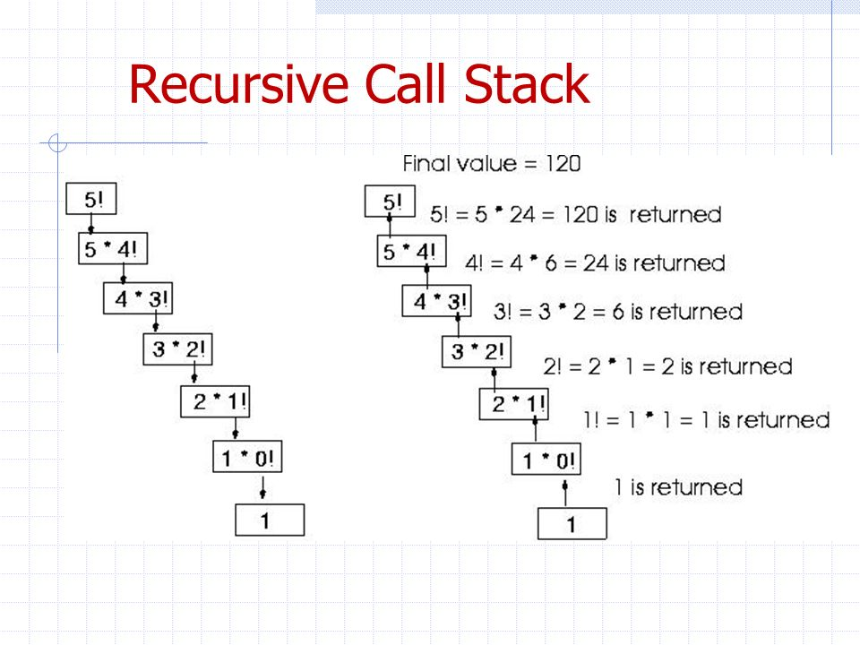
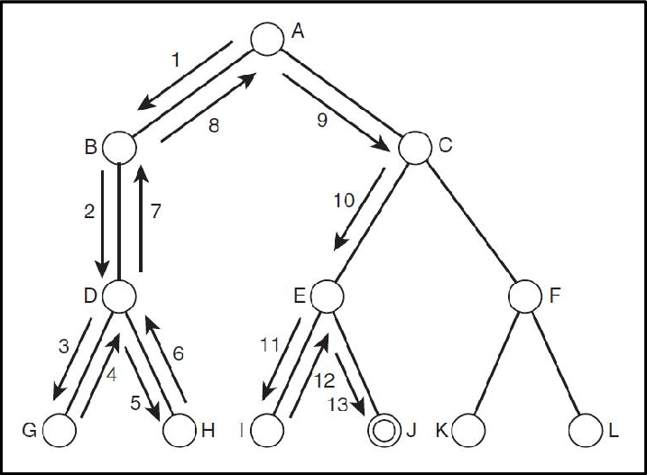
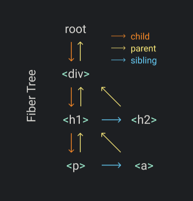
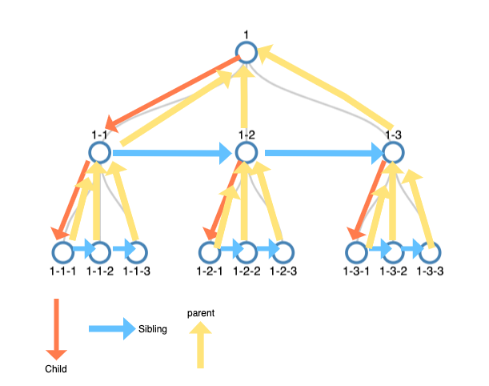

# Intro

- Suspense and Concurrent Mode help improve user experience when CPU or IO work is lagging
- Also improve user experience when CPU/IO is fast (no flash of loading spinners/jankiness which causes reflows and slower perceived user experience)
- Allows a web app to feel like a fast & fluid native app with smooth responsive transitions
- facebook is building v5 of their site on these features and [it looks awesome](https://developers.facebook.com/videos/2019/building-the-new-facebookcom-with-react-graphql-and-relay/)
  - experimental but already used in complex app that serves billions of users

# Suspense

- Initial impression = just makes loading logic a bit easier, but in a [bizarre way (throwing promises)](https://twitter.com/sebmarkbage/status/941163837625057280)
- Much more than that
- Inversion of control (child declares data dependencies) keeps components isolated and modular
- Parent or previous screen is completely agnostic of data needs - whether the child/next screen needs to suspend waiting for code-split components to load, images, data, or other assets. Doesn't care. Enables loose-coupling
- Can be used separately from concurrent mode, but in conjunction with concurrent mode, it faciliates some interesting patterns that significantly improve user experience (such as remaining on current screen and staying responsive to user input while rendering next screen in memory (creating dom nodes and running user code in components))
- Similar to declarative error boundaries:
  - https://jsfiddle.net/491na827/1/
  - Code also in this repo
    - error boundary will show in development. Click x on error overlay or escape
    - or just run build version: `yarn run build && serve -s build`
- Suspense Boundaries function like a try...catch:
  - [31 min mark of facebook demo](https://www.facebook.com/FacebookforDevelopers/videos/1752210688215238/?t=1854)
  - https://dev.to/pomber/)about-react-suspense-and-concurrent-mode-21aj
- React DevTools let you toggle suspending state of components to test out your boundaries:
  - https://react-devtools-tutorial.now.sh/toggling-suspense-fallbacks

# Concurrent Mode

- Many names: async rendering, time slicing, and now concurrent mode

## What causes janky unresponsive screens?

- https://javascript.info/event-loop
- [What the heck is the event loop anyway?](https://www.youtube.com/watch?v=8aGhZQkoFbQ)
  - [loupe demo from talk](http://latentflip.com/loupe)

## How Concurrent Mode works

- UI frameworks today have to complete rendering on state change before responding to user input
- React Concurrent Mode keeps screen responsive
  - [Dan's original jsconf demo app](http://timeslicing-unstable-demo.surge.sh/)
    - `shift /` to bring up frame tracker
    - `shift` click to mount/unmount chart
- Splits up rendering into units of work and intermittently yields back to browser to handle user events:
  
- Think of it like a git branch. It works on new UI changes in memory and only commits to "master" (the actual DOM) when all the changes are ready
- babel [converts your JSX expressions at build time](https://babeljs.io/repl#?browsers=&build=&builtIns=false&spec=false&loose=false&code_lz=MYewdgzgLgBAyiAtgUwMJIA7mWWBeGACgEoY8A-IgKBgEgAeAEwEsA3cmmL-gCwEZyCFDHSIsYHFHoB6fhy7cM5AOo8AhlGStkAJxgB3HiBjA1O5BBlLO3AK4AbeQu73m5V9BjNNiGHxmuTs70gR6w3si-AEwBbjYwMg5BCdIs7FTEQA&debug=false&forceAllTransforms=false&shippedProposals=false&circleciRepo=&evaluate=false&fileSize=false&timeTravel=false&sourceType=module&lineWrap=true&presets=es2015%2Creact%2Cstage-2&prettier=true&targets=&version=7.7.5&externalPlugins=) to virtual declarative objects, react [reconciles/diffs](https://github.com/pomber/didact/blob/39cde39639e155700ea976a13be6f62b104e5f18/didact.js#L244-L300) the virtual dom elements with actual dom nodes, and then [commits the changes to dom](https://github.com/pomber/didact/blob/39cde39639e155700ea976a13be6f62b104e5f18/didact.js#L92-L138)
- You may have heard this word "fiber" before. Before "fiber" architecture, React would recursively render all your virtual dom elements and their children. Rendering was not interruptible because each recursive call got pushed to call stack and they all had to run at once:
  
- Fiber architecture introduces a "fiber" data structure that allows react to process converted JSX elements in same order as recursive algorithm, but in a while loop that is interruptible so react can intermittently yield back to browser to stay responsive:
- [DEMO interruptible fiber algorithm](https://codesandbox.io/s/fiber-demo-pvwgo)
  - code also in repo in fiber-demo folder
- Fibers loosely-correspond to components and have pointers to child, parent, and sibling (like a linked list)
  
  
  
- Fibers also enable stateful functional components because react internally associates your `useState` and `useEffect` hooks with the currently rendering fiber

# Data Fetching Patterns

- Just scratching the surface here...
- Remaining on current screen and staying responsive to user input while rendering next UI state in memory
  - [Movies example from Dan's talk](https://hitchcock-movies.netlify.com/)
  - [Suspensify example from Jared Palmer's talk](https://hitchcock-suspensify.netlify.com/)
  - Debugger tool: https://github.com/pomber/hitchcock
- Without concurrent mode:
  - Render before IO/data returns = worse _perceived_ loading
  - Render after data returns = worse _actual_ loading due to IO->CPU waterfall (wasted cycles while waiting for data to return)
- Keep type-ahead responsive without debouncing or throttling
  - https://reactjs.org/docs/concurrent-mode-patterns.html#deferring-a-value
- Helps facilitate patterns of fetching data, code, assets in parallel and preventing waterfalls
- Facebook's v5 components declare data dependencies in GraphQL fragments
- Relay aggregates these fragments at build time into top-level queries
  - can defer/stream lower-priority data and load above the fold content first so lower-priority does not suspend transition
- build time step allows parents to stay agnostic of child component's data needs and faciliates loose-coupling/reusability
- Suspense/concurrent mode keep everything loading in smoothly and in intentional order
- components do not initiate the fetching of data (this leads to waterfalls)
- Route change or tab switch or next button events will trigger fetching of data
  - https://reactjs.org/blog/2019/11/06/building-great-user-experiences-with-concurrent-mode-and-suspense.html
- REST proof of concept:
  - https://github.com/gaearon/suspense-experimental-github-demo
- Splitting low/high priority updates allows better perceived user experience:
  - https://twitter.com/dan_abramov/status/1120986057363939328
  - https://reactjs.org/docs/concurrent-mode-patterns.html#deferring-a-value
- Many of these patterns would be difficult if not impossible without concurrent mode and suspense

# Other implications

- Are some of these patterns only possible with [Virtual Dom](https://twitter.com/dan_abramov/status/1120971795425832961)?
  - Not sure compilers like Svelte can achieve such patterns when state changes mutate dom immediately
  - [concurrent svelte issue](https://github.com/sveltejs/svelte/issues/4020#issuecomment-563680404)
  - [suspense svelte issue](https://github.com/sveltejs/svelte/issues/3203)
    > We can probably avoid throwing Promises, but I think we need to at minimum execute the children without showing them if necessary. This makes everything more complicated like conditional rendering in between the Suspense placeholder and the asynchronous call. But that's the problem we need to solve.Thats what makes this interesting.
  - Rich Harris (creator of Svelte) has some [compelling critiques of React's virtual dom model](https://www.youtube.com/watch?v=AdNJ3fydeao) and its [leaky functional abstractions layered on inherently stateful mutable browser dom](https://blog.jim-nielsen.com/2019/thoughts-on-rich-harris-talk/)
  - Virtual dom allows React to do some interesting things (concurrent mode, same JSX patterns reconciling with different UI primitives (react native), etc.)
  - This is one of the most interesting debates for the future of frontend frameworks/compilers and is something to keep an eye on:
    - https://mobile.twitter.com/dan_abramov/status/1120772388222844929
    - https://www.reddit.com/r/reactjs/comments/doqedq/why_is_react_concurrent_mode_exciting/f5qzcrk/

# Official Docs

- https://reactjs.org/docs/concurrent-mode-intro.html
  - I easily spent probably an entire weekend reading and rereading parts of these. Lot of concepts and might not be immediately clear how they all relate to each other until you try to write or imagine those patterns without concurrent mode and suspense
- Read the blog post too! They say its only for library authors and not application developers, but a lot of implications didn't click for me until I read the blog post:
  - https://reactjs.org/blog/2019/11/06/building-great-user-experiences-with-concurrent-mode-and-suspense.html
- Relay Hooks experimental (only data fetching library currently compatible with concurrent mode)
  - https://relay.dev/docs/en/experimental/step-by-step
